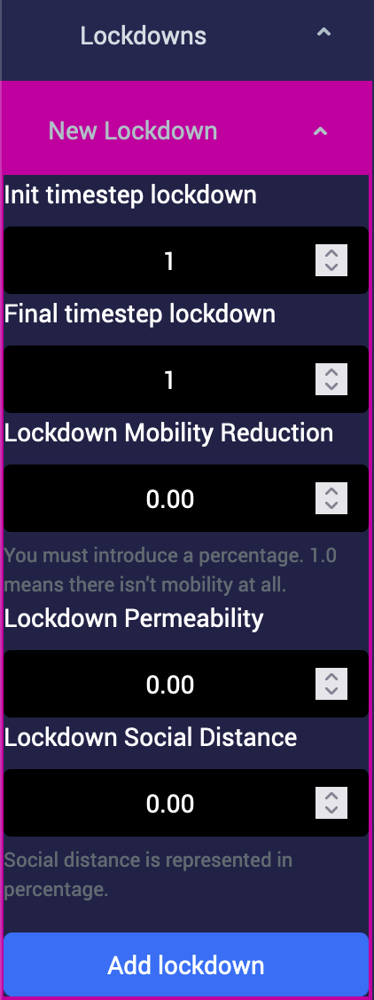
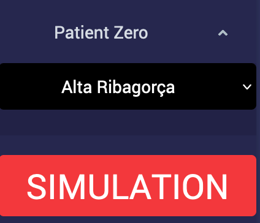
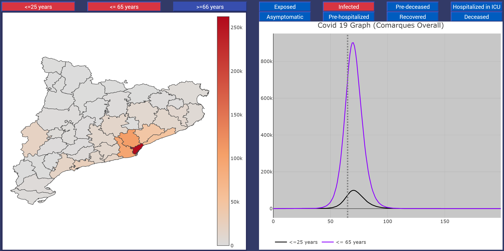
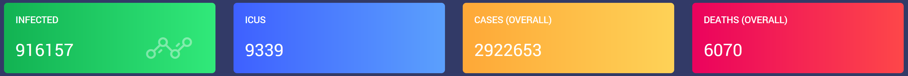
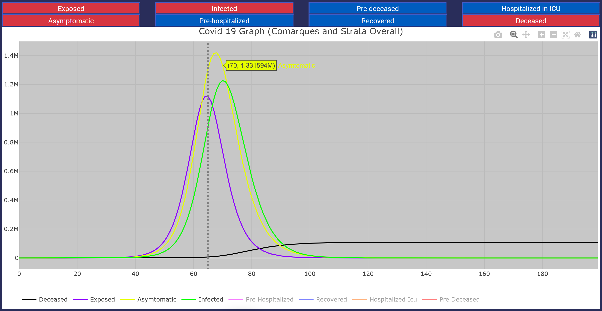
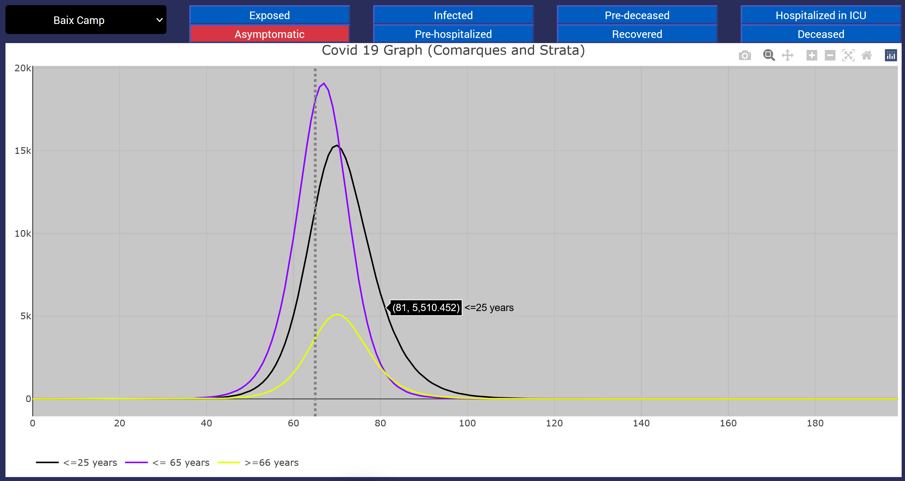

# Covid-19 Simulator 

Dashboard for COVID-19 simulations corresponding to project _2020PANDE-00098: Modelització probabilística per a predir l’evolució de la COVID-19: parametrització i correcció automàtica_, developed at [Universitat Rovira i Virgili](https://www.urv.cat). Its purpose is to simulate the spread of the COVID-19 in Catalonia at the region ("_comarca_") level. 

The user can enter into the simulation its _duration_ (number of timesteps, that represent days), the location of the _zero patients_ (seeds of COVID-19 spreading), and the _confinement policies_.

The interactive dashboard is available at [Alephsyslab Covid-19 Simulator](https://simulator.alephsyslab.com/).
It is recommended to use Firefox or Chrome.

The simulations are based on the model described in reference

- A Arenas, W Cota, J Gómez-Gardeñes, S Gómez, C Granell, JT Matamalas, D Soriano-Paños, B Steinegger: Modeling the spatiotemporal epidemic spreading of COVID-19 and the impact of mobility and social distancing interventions. _Physical Review X_ **10** (2020) 041055. [DOI:10.1103/PhysRevX.10.041055](https://doi.org/10.1103/PhysRevX.10.041055).

The source code of this model, developed in the [Julia](https://julialang.org/) programming language, can be found here: [MMCAcovid19.jl](https://github.com/jtmatamalas/MMCAcovid19.jl). Its documentation can be found here: [MMCAcovid19.jl Documentation](https://jtmatamalas.github.io/MMCAcovid19.jl/v0.1/).

## How to use

Initially, when the dashboard is first accessed, the model has a default simulation configuration, with a single patient zero located at Alta Ribagorça, and without confinement mesures.

Use the menu on the left to add _lockdowns_. Each lockdown is characterized by:

* Initial timestep of the lockdown.
* Final timestep of the lockdown.
* Mobility reduction.
* Permeability of confined households.
* Social distancing.

The last three parameters represent probabilities, thus they take values between 0.0 and 1.0.

Use _patient zero_ to select the region where the first infected will be in the simulation.

Once the parameters of the simulation are set up, simply press the red _Simulation_ button to start.

## Plots

Use the _Time steps_ slider to choose a date (a time step of the simulation).

The map of Catalonia shows the state of the simulation at the selected time step, and for the selected age strata categories:

* Lower or equal than 25 years old ("<= 25 years").
* Between 26 and 65 years old ("<= 65 years").
* Greater or equal than 66 years old (">= 66 years").

In the plot to the right of the map, it is shown the time evolution of the selected compartment, and for the selected age strata.
According to the model, the possible compartments to choose from are:

* Exposed (E): incubating the disease, not infectious.
* Infected asymptomatic (A): infectious, without symptomes of the disease.
* Infected symptomatic (I): infectious, with symptomes of the disease.
* Pre-hospitalized at ICU (PH).
* Pre-deceased (PD).
* Hospitalized at ICU (H).
* Deceased (D).
* Recovered (R).

In the top, four counters show the global values of the most important indicators:

* Infected.
* ICUs.
* Cases (overall).
* Deaths (overall).

The second plot shows the sum of the stratas and the regions. This plot allows you to select multiple states to compare their evolution.

If you hover over the previous plots (including the map), you will get extra information.

The final plot shows the evolution of the simulation by region. Select the region you want to obtain the information.

                        
## Additional information

The dashboard can also calculate the data of Bias Closest, Exponent Closest, Prevalence Closest.

