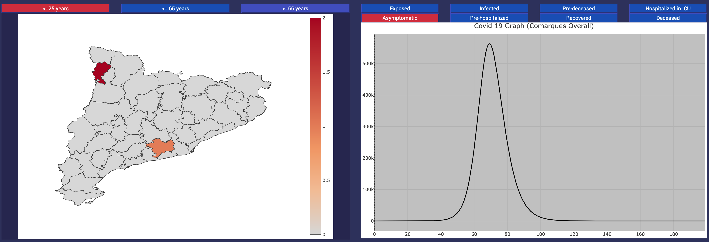
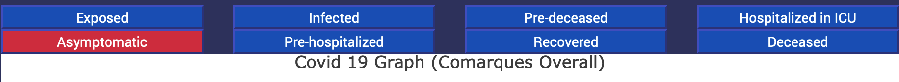

Covid-19 Simulator 
========

Dashboard for COVID-19 simulations corresponding to project _2020PANDE-00098: Modelització probabilística per a predir l’evolució de la COVID-19: parametrització i correcció automàtica_, developed at [Universitat Rovira i Virgili](https://www.urv.cat). Its purpose is to simulate the spread of the COVID-19 in Catalonia at a region ("_comarca_") level. 

The user can enter how many simulation timesteps (days), the confinement policies and the zero patient.

The model is available for use in [Alephsyslab Covid-19 Simulator](https://simulator.alephsyslab.com/).
**It is recommended use Firefox or Chrome.**

The implementation of the model used can be found here [Covid-19 Model](https://github.com/jtmatamalas/MMCAcovid19.jl).

The model documentation can be found here [Covid-19 Model Documentation](https://jtmatamalas.github.io/MMCAcovid19.jl/v0.1/).

 
Research Group
==========

How to use
=================

Initially, when the web is accessed, the model has a simulation configuration by default. 
The default configuration does not have any restrictions and patient zero is located in the Alta Ribagorça region.

Use the menu on the left to add confinements. It defines a range of timesteps for the confinement and 
then its options.

* Mobility reduction.
* Permeability of confined households.
* Social distancing.

**All characteristics have a range [0-1]**

Use patient zero to select the region where the first infected will be in the simulation.

Once the simulation is set up, simply press the red simulation button to start.

Graphs
=================

The first graph represents the sum of all the cases of the regions. This total sum is divided 
by the population strata categories.

* Lower or equal than 25 years old
* Between 26 and 65 years old
* Greater or equal than 66 years old

Use the different states of the simulation to display the information you want to display on the graph.

* Susceptible (S): healthy individual.
* Exposed (E): incubating the disease, not infectious.
* Infected asymptomatic (A): infectious, without symptomes of the disease.
* Infected symptomatic (I): infectious, with symptomes of the disease.
* Pre-hospitalized to ICU (PH).
* Pre-deceased (PD).
* Hospitalized in ICU.
* Deceased (D).
* Recovered (R).

The second graph shows the sum of the stratas and the regions. This graph allows you to select multiple states to compare 
the evolutions of the different states.

The final graph shows the evolution of the simulation by region. Select the region you want to obtain the information.

Alternative Model
=================

There is an alternative model to estimate the evolution of Covid-19 in Catalonia. Unlike the main one, this only shows 
the data of Bias Closest, Exponent Closest, Prevalence Closest.

