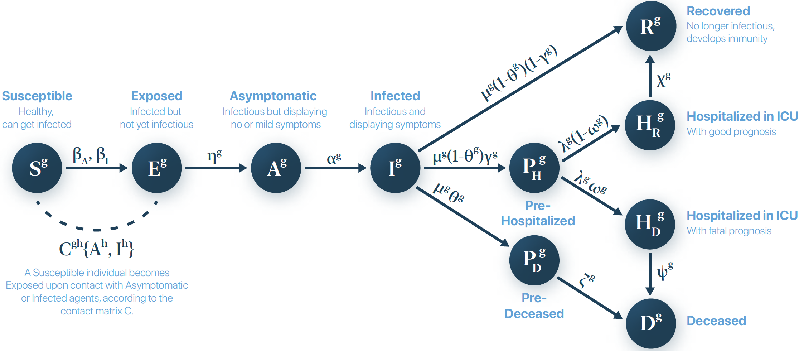

# MMCAcovid19.jl

[![][docs-latest-img]][docs-latest-url]

The 2020 worldwide COVID-19 epidemic outbreak is probably one of the major challenges faced by humanity in our currently highly interconnected society. While a functional vaccine is developed, we must rely only on non-pharmaceutical interventions, which include mobility restrictions, confinement, social distancing, partial lockdown, or total lockdown of non-essential services. The effective evaluation of any of these policies requires a detailed enough modeling of the spreading of this epidemics.

## Model

This package [MMCAcovid19](https://github.com/jtmatamalas/MMCAcovid19), written in the [Julia](https://julialang.org) language, implements the epidemic model for COVID-19 developed by a group of reserachers from [Universitat Rovira i Virgili](https://www.urv.cat) and [Universidad de Zaragoza](http://unizar.es) [[1](#References-1)]. The model makes use of a Microscopic Markov Chain Approach (MMCA) to describe mathematically the dynamics of a so-called metapopulation model of epidemic spreading [[2-4](#References-1)].

### Description

The main ingredients of the model are the following:

- The area to analyze is divided in patches, e.g., municipalities, counties, regions, or any other desired level of resolution.
- The surface of each patch, to account for density.
- The stratification of the population in groups with different mobility, contacts, or epidemic parameters, e.g., stratification by age.
- The stratified population at each patch.
- The stratified daily mobility (commuting) between patches.
- The stratified average number of contacts.
- The contacts distribution between strata.
- The epidemic parameters.

As is common practice in the description of epidemic spreading, we have considered a set of compartments to describe the different stages of people in front of the disease, selected according to the current knowledge of COVID-19 (see [[1](#References-1)] for the details):

- Susceptible (S): healthy individual.
- Exposed (E): incubating the disease, not infectious.
- Infected asymptomatic (A): infectious, without symptomes of the disease.
- Infected symptomatic (I): infectious, with symptomes of the disease.
- Pre-hospitalized to ICU (PH)
- Pre-deceased (PD)
- Hospitalized in ICU patients who will recover (HR)
- Hospitalized in ICU patients who will not recover (HD)
- Deceased (D).
- Recovered (R).

The transitions between compartments, including their corresponding epidemic parameters, are:

Once all the information about population and epidemic parameters is introduced, the model is capable of predicting the evolution of the disease at the level of patch and for each of the epidemic compartments. Since MMCA is a discrete time formalism, we have selected a time resolution of a day, the natural one to account for contacts, mobility and epidemic rates.

### Containment

The model is able to include containment measures:

- Mobility reduction.
- Permeability of confined households.
- Social distancing.

This package allows the application of multiple containment measures at different dates, thus enabling the analysis of elaborated containment policies.

## References

1. Alex Arenas, Wesley Cota, Jesús Gómez-Gardeñes, Sergio Gómez, Clara Granell, Joan T. Matamalas, David Soriano-Paños and Benjamin Steinegger: Modeling the spatiotemporal epidemic spreading of COVID-19 and the impact of mobility and social distancing interventions, _Physical Review X_ **10** (2020) 041055 ([doi](https://doi.org/10.1103/PhysRevX.10.041055))

2. Sergio Gómez, Alex Arenas, Javier Borge-Holthoefer, Sandro Meloni and Yamir Moreno: Discrete-time Markov chain approach to contact-based disease spreading in complex networks, _Europhysics Letters_ **89** (2010) 38009 ([doi](https://doi.org/10.1209/0295-5075/89/38009))

3. Jesús Gómez-Gardeñes, David Soriano-Paños and Alex Arenas: Critical regimes driven by recurrent mobility patterns of reaction-diffusion processes in networks, _Nature Physics_ **14** (2018) 391–395 ([doi](https://doi.org/10.1101/2020.03.21.20040022))

4. David Soriano-Paños, L. Lotero, Alex Arenas and Jesús Gómez-Gardeñes: Spreading processes in multiplex metapopulations containing different mobility networks, _Physical Review X_ **8** (2018) 031039 ([doi](https://doi.org/10.1103/PhysRevX.8.031039))

## Authors

### Coordinators

- [Alex Arenas](http://deim.urv.cat/alexandre.arenas) (Universitat Rovira i Virgili, Tarragona, Spain)

- [Jesús Gómez-Gardeñes](http://complex.unizar.es/~jesus/) (Universidad de Zaragoza, Zaragoza, Spain)

### Researchers

- [Wesley Cota](http://wesleycota.com/) (Universidade Federal de Viçosa, Minas Gerais, Brazil)

- [Sergio Gómez](http://deim.urv.cat/~sergio.gomez) (Universitat Rovira i Virgili, Tarragona, Spain)

- [Clara Granell](http://complex.unizar.es/~jesus/) (Universidad de Zaragoza, Zaragoza, Spain)

- [Joan T. Matamalas](https://www.linkedin.com/in/jtmatamalas) (Harvard Medical School, Boston, USA)

- [David Soriano-Paños](https://twitter.com/sorianopanos) (Universidad de Zaragoza, Zaragoza, Spain)

- [Benjamin Steinegger](https://twitter.com/stinomat) (Universitat Rovira i Virgili, Tarragona, Spain)

## Documentation

The full documentation of [MMCAcovid19](https://github.com/jtmatamalas/MMCAcovid19) can be found [here][docs-latest-url]

[docs-latest-img]: https://img.shields.io/badge/docs-latest-blue.svg
[docs-latest-url]: http://jtmatamalas.github.io/MMCAcovid19.jl/v0.1/
